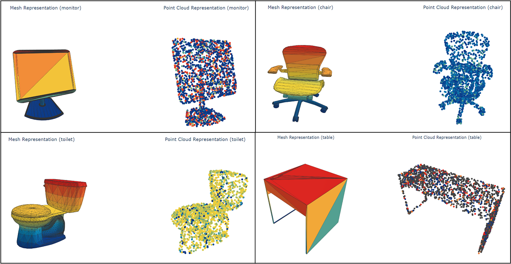
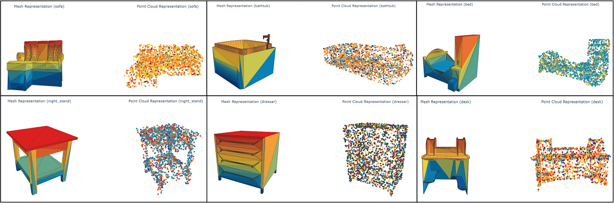

# 3D Object Classification from Point Cloud using Graph Neural Net
**Dataset**: [ModelNet10 benchmark data](https://people.csail.mit.edu/khosla/papers/cvpr2015_wu.pdf) – a large-scale 3D CAD model dataset containing 10 classes.
- **Classes:** bathtub, bed, chair, desk, dresser, monitor, night_stand, sofa, table, toilet

### Brief Description:
- First step was to transform 3D mesh objects to pointcloud objects.
- From these point clouds, graphs were constructed based on nearest neighboring nodes.
- After previous two steps, a rotation invariant framework [**Point Pair Feature Net(PPFNet)**](https://arxiv.org/abs/1802.02669) has been implemented and modified to handle graph point cloud data.

### Test Result:
| Accuracy  | Balanced Accuracy |
| ------ | ------ |
| 0.752  | 0.734 |

### Libraries and Frameworks
- For model building: **PyTorch** & **PyTorch Geometric**
- For hyperparameter tuning: **Optuna**
- For tracking model performance: **MLflow**
- Object Visualization: **Plotly**

### Sample 3D Objects:
Sample representation of 3D Mesh Objects and their respective Point Clouds are given below:

